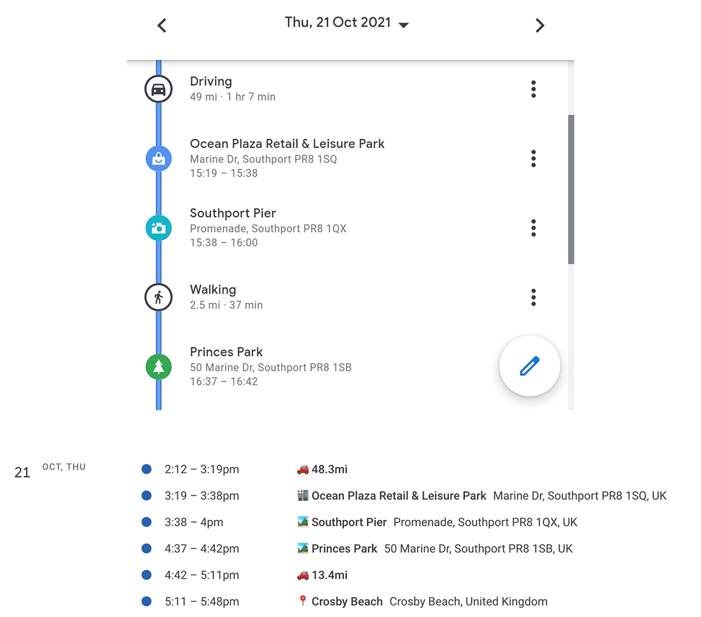

# GMap2iCal - Google Maps to iCal

.

A small utility written in Kotlin to convert Google Maps activity timeline to iCal (.ics) files for calendar import.

This is not an Android App, you may just open the project using IntelliJ IDEA and run it on your desktop environment.

As this is my first non-Android Kotlin project, I would allow myself to utilize it as a playground, and to make all kind
of mistakes in order to learn and improve.

## Background

I travelled quite a lot before the pandemic. Very often my daily itinerary changes at the last minute. This made me a
headache recalling where I have been to previously.

I use Google Maps for navigation heavily, and I have it tracked my movement for quite many years.

I had an idea to extract my activity timeline from the Google Maps, but unfortunately there is no public API available.
It might be possible to achieve that using some web scrapping techniques, but this approach is not likely to be an
elegant one.

That is why I am trying another way round: By setting Google Maps to regularly export my activity timeline as JSON
files, I can then process them using this Kotlin utility, and generate iCal (.ICS) files which I can then import to my
calendars.

By doing so, I can keep a full record of the places I have actually been, and also the rough mileages I have spent on
the road.

## Status

A basic implementation bare enough to convert and export the data for personal use is done.

The presentation for driving starting and ending locations is to be improved. This is because the location data (
coordinates and place Ids) returned by Google Maps are not always accurate (or even not exists).

Further effort is required to improve the coding/architecture, and to complete the items on the Todo List.

## How to prepare the data set for processing

1. Go to [Google Takeout](https://takeout.google.com/)
2. Make sure you have included **"Location History"** in your export request.
3. Create an export and wait for completion. _This process can take a long time (possibly hours or days) to complete.
   You'll receive an email when your export is done._
4. Unzip the data file.
5. The JSON files under `/Location History/Semantic Location History` are the files we need.
6. Move the JSON files to a directory, for example `./src/main/resources` of this project.
7. Update, or create yor own configuration file `uk.ryanwong.gmap2ics.configs.DefaultConfig` to specify the input and
   output paths.
8. If you have created a duplicated configuration file, update the file path in `Main.kt`
9. Run the project on IntelliJ IDEA

## Todo list

- Exception handling
- More test cases
- Compose Desktop UI