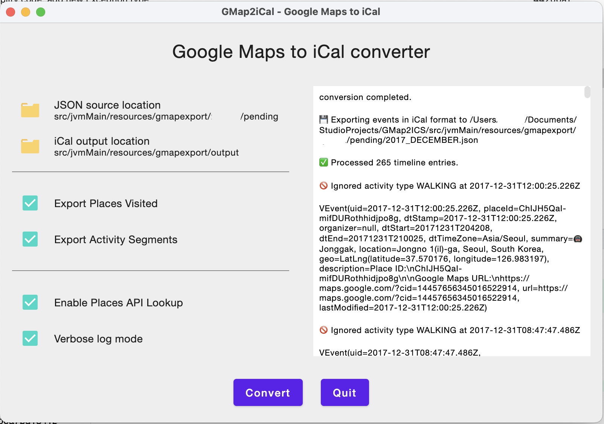

# GMap2iCal - Google Maps Timeline to iCal
### My first Compose for Desktop App

A small utility written in Kotlin to convert Google Maps Activity Timeline to iCal (.ics) files for calendar import.

This is not an Android App. It can be built and executed using IntelliJ IDEA on the desktop environment.

This is my first non-Android Kotlin project. It is within expectation that everything inside this project can be messy. I treat this as my playground that allows me to make all kinds of experiments and mistakes. While I thank you for your visit, I would appreciate if you could take things easy when you see me doing something crazy here. Thank you.

## TLDR - Status and Roadmap

This App is fully functional.

* More unit tests are being written to increase coverage.
* Migrate Retrofit to Ktor
* Integrate SQLite as preferences store, and Google Maps Place API caches
* Dependency Injection. Probably Koin
* Full RW MobiMedia UK commercial grade UX - phase out hardcoded config profiles. _This is expensive and subject to budget._

## Background

I travelled quite a lot before the pandemic. Very often my daily itinerary changes at the last minute. This made me a
headache recalling where I have been to previously.

I use Google Maps for navigation heavily, and I have it tracked my movement for quite many years.

I had an idea to extract my activity timeline from the Google Maps, but unfortunately there is no public API available.
It might be possible to achieve that using some web scrapping techniques, but this approach is not likely to be an
elegant one.

That is why I am trying another way round: By setting Google Maps to regularly export my activity timeline as JSON
files, I can then process them using this Kotlin utility, and generate iCal (.ICS) files which I can then import to my
calendars.

By doing so, I can keep a full record for the places I have actually been, and also the rough mileages I have spent on
the road.

## Skills covered:

Trying to reuse all my Android development knowledge as possible, otherwise native replacements have been applied.

### High level architecture

* Kotlin
* Kotlin Flow, Coroutines, Serialization
* Compose Desktop UI
* MVVM architecture with use-cases

### Major libraries used

* [Time Zone Map](https://github.com/dustin-johnson/timezonemap) - determine time zone 
* [Jackson](https://github.com/FasterXML/jackson) - JSON parser
* [JUnit 5](https://github.com/junit-team/junit5) - Tests
* [KOTest](https://kotest.io/) - Test framework
* [MockK](https://mockk.io/) - Mocking library
* [Retrofit2](https://square.github.io/retrofit/) - to be replaced by Ktor soon

## How to export the Google Maps Timeline as the data set for processing

.

1. Go to [Google Takeout](https://takeout.google.com/)
2. Make sure you have included **"Location History"** in your export request.
3. Create an export and wait for completion. _This process can take a long time (possibly hours or days) to complete.
   You'll receive an email when your export is done._
4. Unzip the data file.
5. The JSON files under `/Location History/Semantic Location History` are the files we need.
6. Move the JSON files to a directory, for example `./src/main/resources` of this project.
7. Update, or create yor own configuration file `uk.ryanwong.gmap2ics.configs.DefaultConfig` to specify the input and
   output paths.
8. If you have created a duplicated configuration file, update the file path in `Main.kt`
9. Run the project on IntelliJ IDEA
